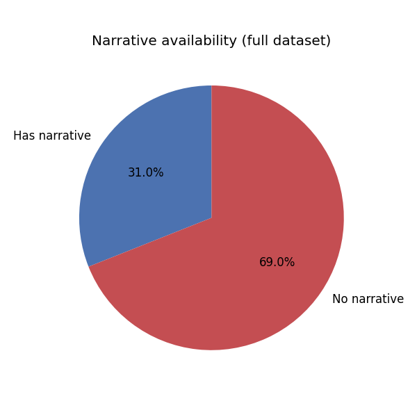
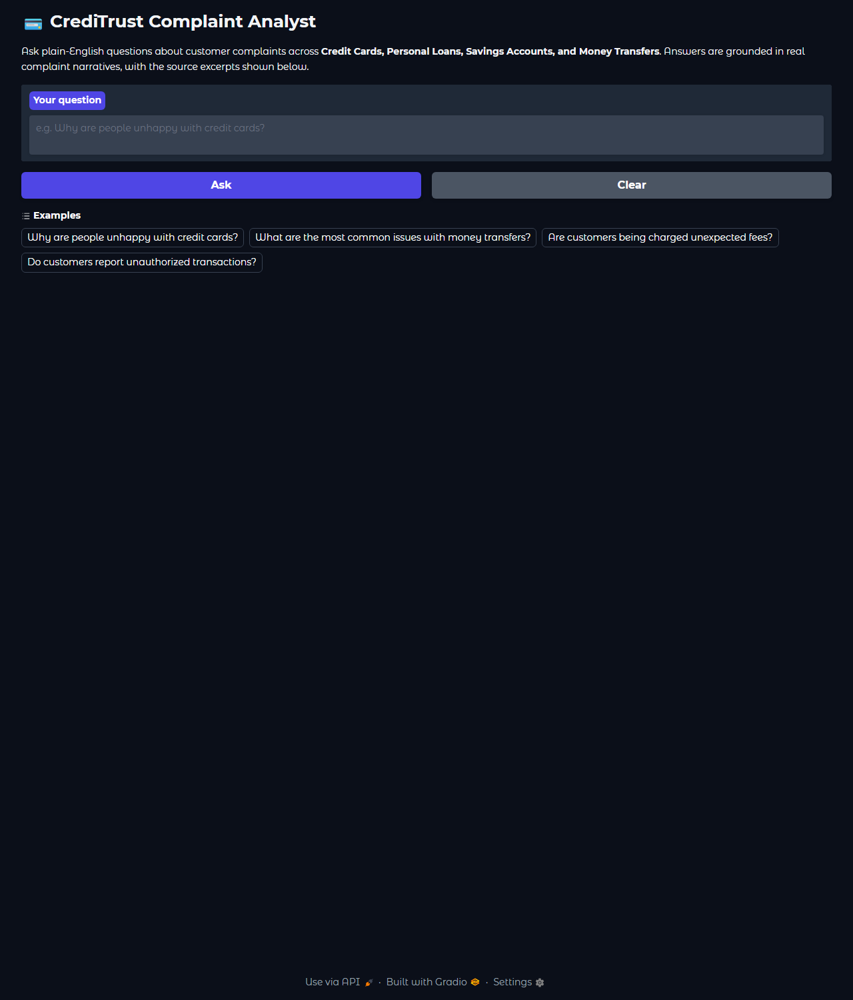
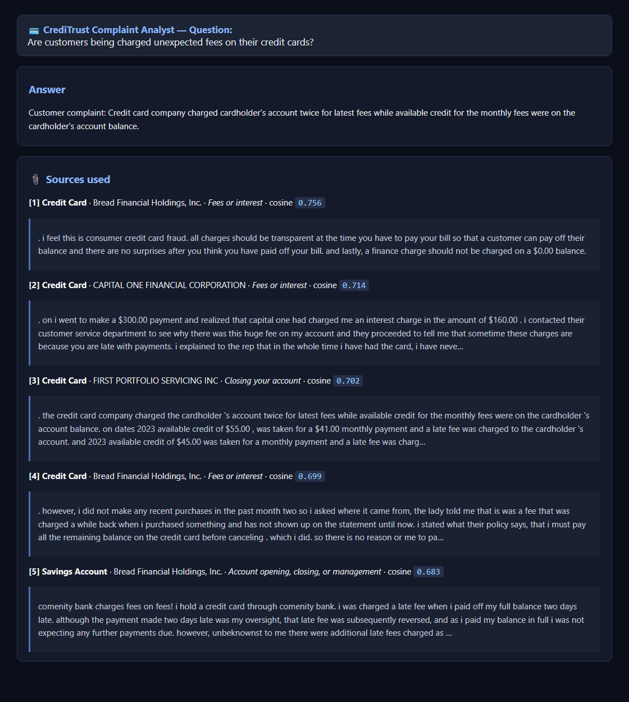

# From Complaints to Clarity: Building a RAG-Powered Complaint Analyst for CrediTrust

*A data-to-deployment walkthrough of an internal AI assistant that turns 480,000+
raw financial complaints into evidence-backed answers in seconds.*

Author: Yomiyu Wakweya · Repository: https://github.com/yomiyu15/rag-complaint-chatbot

---

## 1. Introduction — the business problem

CrediTrust Financial is a mobile-first digital finance company serving East African
markets across four products: **credit cards, personal loans, savings accounts, and
money transfers**. With 500,000+ users in three countries, it receives thousands of
complaints a month through in-app channels, email, and regulatory portals. No human
team can read that volume, so trends surface late and teams stay reactive:

- **Product Managers** can't see the top issues per product quickly.
- **Support** is buried in volume.
- **Compliance** spots repeat problems only after they escalate.
- **Executives** lack visibility into emerging pain points.

**The solution** is an internal **Retrieval-Augmented Generation (RAG)** assistant.
A non-technical user (say Asha, a Credit Cards PM) asks a plain-English question —
*"Why are people unhappy with credit cards?"* — and gets a synthesized answer in
seconds, **with the source complaint excerpts shown** so the answer can be trusted
and verified. The target: cut trend-finding from days to minutes, let non-technical
teams self-serve, and move the company from reactive to proactive.

This report walks through all four build stages: EDA & preprocessing, chunking &
embedding, the RAG core + evaluation, and the interactive UI.

---

## 2. Technical choices

### 2.1 Data
The [CFPB Consumer Complaint Database](https://www.consumerfinance.gov/data-research/consumer-complaints/)
— real, public complaints against U.S. financial firms. The raw export is ~6 GB
(~9.6M rows, 18 columns): product/company metadata, a short issue label, a free-text
consumer narrative, and dates.

### 2.2 EDA & preprocessing (Task 1)
Because the file is far larger than memory, [`src/eda_preprocessing.py`](../src/eda_preprocessing.py)
**streams** the CSV in 500k-row chunks and accumulates statistics in one pass. Key
findings (full numbers in [`reports/eda_summary.json`](eda_summary.json)):

| Metric | Value |
|---|---|
| Total complaints | 9,609,797 |
| With a narrative | 2,980,756 (**31.0%**) |
| Filtered corpus (4 target products, with narrative) | **480,576** |
| Narrative words (median / mean / max) | 137 / 205.6 / 6,469 |
| Long narratives (>300 words) | 93,443 |

**Insights that shaped the pipeline:** only ~31% of complaints carry a narrative, so
the 6.6M metadata-only rows are dropped (RAG needs text). Credit-reporting dominates
the raw data, so the four target families are assembled from overlapping CFPB labels
via a `PRODUCT_MAP`. The long tail of verbose narratives directly motivates chunking.
Cleaning (`clean_narrative()`) lowercases, strips `XXXX` PII redactions, removes
boilerplate openers ("I am writing to file a complaint…") and special characters, and
normalizes whitespace.

### 2.3 Chunking & embedding (Task 2)
Implemented in [`src/chunk_embed_index.py`](../src/chunk_embed_index.py).

- **Stratified sample:** 12,000 complaints drawn from the 480,576-row corpus,
  allocated to each category in proportion to its real share (seed=42, reproducible).
  This keeps the minority **Personal Loan** class (7.8%) represented instead of
  swamped.

  | Category | Full corpus | Share | Sample |
  |---|---:|---:|---:|
  | Credit Card | 189,333 | 39.4% | 4,728 |
  | Savings Account | 155,202 | 32.3% | 3,875 |
  | Money Transfer | 98,700 | 20.5% | 2,465 |
  | Personal Loan | 37,341 | 7.8% | 932 |

- **Chunking:** LangChain `RecursiveCharacterTextSplitter`, **`chunk_size=500`,
  `chunk_overlap=50`**. Rationale: long complaints embedded as a single vector blur
  distinct issues; 500-char chunks stay topically focused and the overlap avoids
  cutting a point across a boundary. This matches the challenge's pre-built store, so
  the embedding space is consistent. Result: **34,978 chunks** (2.91 per complaint).

- **Embedding model:** `sentence-transformers/all-MiniLM-L6-v2` (**384-dim**). Fast
  and CPU-friendly (~15 min for the full sample), strong on short-text similarity, and
  identical to the model behind the provided full-scale store. Vectors are
  L2-normalized so inner product = cosine similarity.

- **Vector store:** a **FAISS `IndexFlatIP`** index (`vector_store/index.faiss`) with
  a row-aligned parquet sidecar (`vector_store/chunks.parquet`) holding chunk text and
  all metadata (`complaint_id`, `product_category`, `product`, `issue`, `sub_issue`,
  `company`, `state`, `date_received`, `chunk_index`, `total_chunks`) — so every
  retrieved chunk traces back to its source. *(FAISS was chosen over ChromaDB — both
  are permitted — because Chroma's heavy dependency chain would not install reliably
  over the available network.)*

### 2.4 The RAG core (Task 3)
[`src/rag_pipeline.py`](../src/rag_pipeline.py) wires it together:

1. **Retriever** — embed the question with the same MiniLM model, FAISS top-k=5.
2. **Prompt** — a grounded template instructing the model to act as a CrediTrust
   analyst, use *only* the retrieved excerpts, and admit when the context is
   insufficient.
3. **Generator** — `google/flan-t5-base`, a small CPU-friendly instruction model, via
   `AutoModelForSeq2SeqLM.generate()` (beam search).

The pipeline returns the answer **plus** the ranked sources for display.

---

## 3. System evaluation

Seven representative questions were run end-to-end (full table + raw JSON in
[`reports/rag_evaluation.md`](rag_evaluation.md)). Highlights:

| # | Question | Quality (1-5) | Note |
|---|---|:--:|---|
| 1 | Why unhappy with credit cards? | 4 | Grounded, real theme (arbitrary limit cuts) |
| 2 | Common money-transfer issues? | 2 | Good retrieval, degenerate generation |
| 5 | Unexpected credit-card fees? | 4 | Best retrieval (cos 0.76), specific answer |
| — | *(others 3–7)* | ~3 | Relevant but extractive/terse |

**Average ≈ 3.1 / 5.**

**What worked:** retrieval is strong and trustworthy — every question pulled chunks
from the correct product family (cosine 0.60–0.76), and the visible sources make each
answer auditable.

**What didn't:** generation is the bottleneck. `flan-t5-base` (250M params) tends to
be extractive or terse and occasionally degenerate (Q2). It doesn't synthesize across
the 5 chunks as well as the prompt asks. The clear lever for improvement is a larger
instruction model (`flan-t5-large`, `Mistral-7B-Instruct`, or an API model such as
Claude), optionally with a re-ranker.

---

## 4. UI showcase (Task 4)

[`app.py`](../app.py) is a **Gradio** web app for non-technical users: a question box,
**Ask** and **Clear** buttons, example prompts, an answer area, and — crucially — the
**source excerpts** below every answer for trust and verification.

**The interface:**

**A real answer with its sources** (actual output of the app's `/ask` endpoint for
*"Are customers being charged unexpected fees on their credit cards?"*):

Each source shows the product category, company, issue label, and cosine score, so a
PM can click through from a synthesized claim straight to the underlying complaints.

---

## 5. Conclusion

**Challenges & learnings**
- **Data scale** forced a streaming-first mindset in Task 1 — you can't `read_csv()`
  a 6 GB file; accumulate statistics chunk by chunk instead.
- **Environment reality:** the ML stack initially failed (Python 3.14 + a missing
  Visual C++ runtime broke `torch`/`onnxruntime`). Fixing it — a Python 3.12 venv and
  the VC++ redistributable — was a reminder that reproducible environments are part of
  the engineering, not an afterthought. Network instability also drove the pragmatic
  FAISS-over-ChromaDB choice.
- **Retrieval vs. generation:** a RAG system's trustworthiness comes from retrieval +
  visible sources; the LLM is a summarizer on top. Here retrieval is production-grade
  while the free CPU generator is the weak link — a useful, honest finding.

**Future improvements**
1. Swap `flan-t5-base` for a stronger generator (larger open model or Claude API).
2. Scale from the 12k sample to the full 480k corpus using the pre-built store.
3. Add a cross-encoder re-ranker and answer post-processing.
4. Add product filters and streaming responses in the UI.

**Bottom line:** the foundation — clean data, a proportionally sampled and well-chunked
corpus, semantic retrieval with traceable sources, and a usable UI — is solid and
directly serves CrediTrust's goal of turning complaint noise into fast, evidence-backed
insight.
